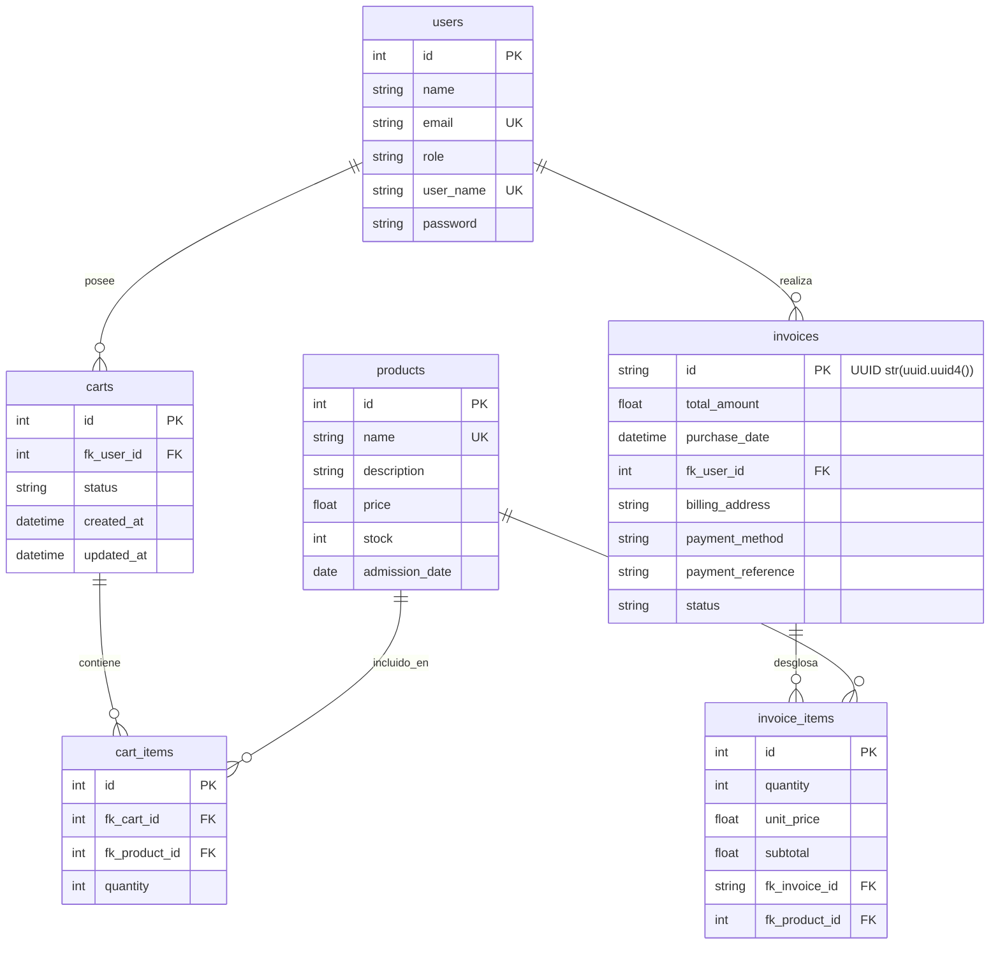

# 📄 Documentación Técnica y Decisiones de Arquitectura (`pet_shot`)

Este documento detalla el diseño de la base de datos, las estrategias de cacheo implementadas, los criterios de TTL e invalidación, y las justificaciones técnicas detrás del desarrollo de la API **`pet_shot`**.

---

## 🗄️ 1. Diagrama ER de la Base de Datos

El modelo entidad-relación fue implementado en PostgreSQL utilizando **SQLAlchemy ORM (DeclarativeBase)**.

---

## 🚀 2. Estrategia de Cacheo, Justificación y TTLs

La API utiliza **Redis** como motor principal de almacenamiento en memoria, con un sistema de **fallback automático (`InMemoryCache`)** en Python por si el servidor Redis se encuentra inactivo.

### 📋 Análisis de Endpoints Cacheados

| Endpoint | Cacheado | TTL | Justificación Técnica |
| :--- | :--- | :--- | :--- |
| `GET /products` | **Sí** | **300s (5 min)** | El catálogo de productos es la operación de lectura más frecuente en un e-commerce. Los precios e inventarios generales sufren modificaciones esporádicas, por lo que cachear esta respuesta reduce drásticamente las consultas a la base de datos PostgreSQL. |
| `GET /products/<id>` | **Sí** | **300s (5 min)** | Permite responder de inmediato las consultas de detalle de un producto individual cuando los clientes navegan la tienda. |
| `GET /invoices` | **Sí** | **600s (10 min)** | El historial de facturación por usuario o general (administrador) es una consulta de lectura intensiva. Las facturas emitidas son inmutables a menos que ocurra una devolución. |
| `GET /invoices/<id>` | **Sí** | **600s (10 min)** | Permite consultar rápidamente el desglose de una compra utilizando su **UUID**. Un tiempo de vida de 10 minutos previene la redundancia en consultas de verificación de compra. |

### ⛔ Endpoints Excluidos del Cacheo

- **`POST /sigin` / `POST /login` / `GET /me`**: Generación dinámica de tokens JWT e información de perfil sensible/específica por solicitud.
- **`GET /carts` / `GET /carts/active`**: El estado del carrito de compras es altamente dinámico y cambia en tiempo real a medida que el cliente agrega o remueve productos. Cachearlo causaría inconsistencias en la experiencia del usuario.

---

## 🔄 3. Reglas de Invalidación de Caché

Para evitar entregar datos desactualizados (stale data), se implementaron disparadores automáticos de invalidación en todas las operaciones de escritura (`POST`, `PUT`, `DELETE`):

1. **Invalidación de Productos (`cache_manager.invalidate_products()`)**:
   - **Disparadores**:
     - `POST /products`: Registro de nuevo producto.
     - `PUT /products/<id>`: Actualización de datos o precios.
     - `DELETE /products/<id>`: Eliminación de un producto.
     - `POST /sales`: Finalización de una compra (reduce el stock disponible).
     - `POST /invoices/<id>/refund`: Devolución de compra (restituye el stock).
   - **Acción**: Elimina del caché todas las llaves con el patrón `products:*`.

2. **Invalidación de Facturas (`cache_manager.invalidate_invoices()`)**:
   - **Disparadores**:
     - `POST /sales`: Creación de una nueva factura de venta.
     - `POST /invoices/<id>/refund`: Cambio de estado de factura a `refunded`.
   - **Acción**: Elimina del caché todas las llaves con el patrón `invoices:*`.

---

## 🔐 4. Control de Acceso y Autenticación (Roles)

- **JWT (`JwtManager`)**: Basado en cifrado asimétrico `RS256` utilizando llaves pem (`private_key.pem` y `public_key.pem`).
- **Decorador `@validate_roles`**:
  - `admin`: Acceso completo a administración de usuarios (`/users`), catálogo de productos (`POST`, `PUT`, `DELETE /products`) y visualización global de facturas.
  - `client`: Acceso limitado a consulta de catálogo, gestión de su propio carrito de compras, ejecución de ventas (`POST /sales`) y consulta de sus propias facturas.
